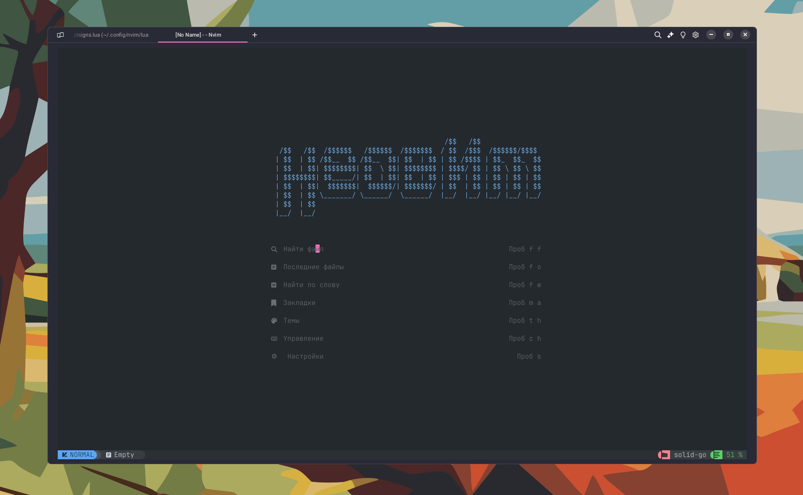
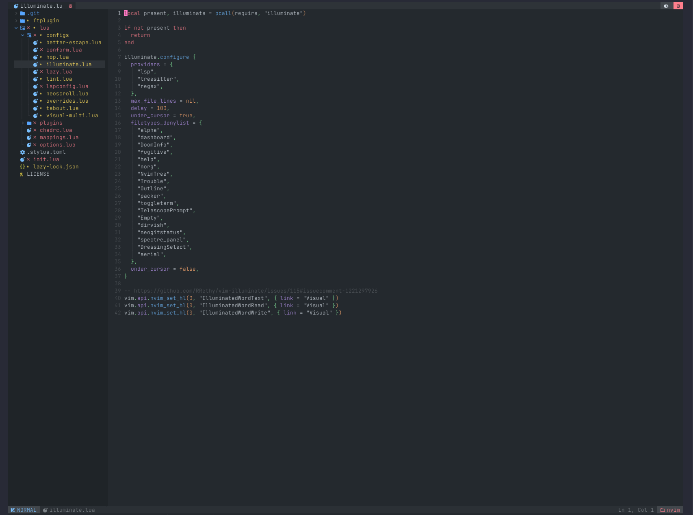
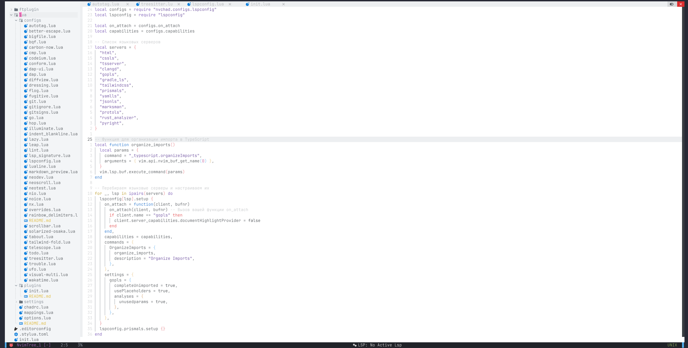

# Конфигурация Nvchad версии 2.5

<p align="center">
  
</p>
</br>
<p align="center">
  
</p>
</br>
<p align="center">
  
</p>
</br>

## Я использую

- [ubuntu 24.04LTS](https://ubuntu.com/download/desktop)
- [wrap](https://www.warp.dev/)
- [nvim](https://github.com/neovim/neovim) v0.11.0-dev
- [nvchad](https://nvchad.com/) v2.5

## Установка

```zsh
git clone git@github.com:MiCkEyZzZ/nvchad-config.git
```

## Основные команды

Здесь перечислены некоторые сочетания клавиш, которые я часто использую.

| Команда                      | Действие                                             |
| ---------------------------- | ---------------------------------------------------- |
| `ctr + n`                    | открытие/закрытие Nvchad меню                        |
| `ctr + u`                    | отмена изменений                                     |
| `ctr + z`                    | сворачивание приложения                              |
| `ctr + \`                    | открытие/закрытие горизонтального терминала          |
| `ctr + ]`                    | открытие/закрытие вертикального терминала            |
| `shift + ← ↑ → ↓`            | выделение/отмена выделения текста                    |
| `shift + tab`                | переключение между вкладками в обратном направлении  |
| `shift + :`                  | коммандная строка                                    |
| `tab`                        | переключение между вкладками                         |
| `v ← ↑ → ↓`                  | выделение/отмена выделения текста                    |
| `s`                          | открыть ткущую папку в проводнике                    |
| `a [имя файла].{расширение}` | создание нового файла в рабочей директории           |
| `a [имя папки]/`             | создание новой папки в рабочей директории            |
| `e`                          | редактирование имя файла или папки                   |
| `d`                          | удаление файла или папки                             |
| `dd`                         | удаление или копирование текущей строки              |
| `p`                          | вставка строки в текущую позицию                     |
| `<leader> + x`               | закрытие вкладки                                     |
| `<leader> + e`               | переход в Nvchad меню                                |
| `<leader> -> m -> p`         | открыть предварительный просмотр Markdown в браузере |
| `<leader> -> m -> c`         | закрыть предварительный просмотр Markdown в браузере |
| `<leader> -> /`              | закомментировать/раскомментировать                   |
| `← ↑ → ↓`                    | выбор пункта при всплывающей подсказке               |
| `:GoCmt`                     | вставка комментария в текущей строке                 |
| `:GoRmTag`                   | удаление тега в текущей строке                       |
| `:GoAddTag`                  | добавление тега в текущей строке                     |

## Поддержка языков

- [x] go
- [x] c++
- [x] c
- [x] rust
- [x] javascript/typescript
- [x] html
- [x] tailwindcss
- [x] python

## Плагины

| Название              | Ссылка                                             |
| --------------------- | -------------------------------------------------- |
| conform.nvim          | https://github.com/stevearc/conform.nvim           |
| vim tmux navigator    | https://github.com/christoomey/vim-tmux-navigator  |
| dressing.nvim         | https://github.com/stevearc/dressing.nvim          |
| nvim-lspconfig        | https://github.com/neovim/nvim-lspconfig           |
| go.nvim               | https://github.com/ray-x/go.nvim                   |
| nvim-nio              | https://github.com/nvim-neotest/nvim-nio           |
| mason.nvim            | https://github.com/williamboman/mason.nvim         |
| nvim-treesitter       | https://github.com/nvim-treesitter/nvim-treesitter |
| nvim-lint             | https://github.com/mfussenegger/nvim-lint          |
| nvim-ts-autotag       | https://github.com/windwp/nvim-ts-autotag          |
| better-escape.nvim    | https://github.com/max397574/better-escape.nvim    |
| hop.nvim              | https://github.com/hadronized/hop.nvim             |
| vim-illuminate        | https://github.com/RRethy/vim-illuminate           |
| neoscroll.nvim        | https://github.com/karb94/neoscroll.nvim           |
| surround.vim          | https://github.com/tpope/vim-surround              |
| vim-visual-multi      | https://github.com/mg979/vim-visual-multi          |
| neotest               | https://github.com/nvim-neotest/neotest            |
| nvim-dap              | https://github.com/mfussenegger/nvim-dap           |
| tailwind-fold.nvim    | https://github.com/razak17/tailwind-fold.nvim      |
| nvim-dap-ui           | https://github.com/rcarriga/nvim-dap-ui            |
| neodev.nvim           | https://github.com/folke/neodev.nvim               |
| fugitive.vim          | https://github.com/tpope/vim-fugitive              |
| vim-flog              | https://github.com/rbong/vim-flog                  |
| diffview.nvim         | https://github.com/sindrets/diffview.nvim          |
| leap.nvim             | https://github.com/ggandor/leap.nvim               |
| nvim-bqf              | https://github.com/kevinhwang91/nvim-bqf           |
| trouble.nvim          | https://github.com/folke/trouble.nvim              |
| todo-comments.nvim    | https://github.com/folke/todo-comments.nvim        |
| codeium.vim           | https://github.com/Exafunction/codeium.vim         |
| carbon-now.nvim       | https://github.com/ellisonleao/carbon-now.nvim     |
| lualine.nvim          | https://github.com/nvim-lualine/lualine.nvim       |
| solarized-osaka.nvim  | https://github.com/craftzdog/solarized-osaka.nvim  |
| lsp_signature.nvim    | https://github.com/ray-x/lsp_signature.nvim        |
| nvim-cmp              | https://github.com/hrsh7th/nvim-cmp                |
| markdown-preview.nvim | https://github.com/iamcco/markdown-preview.nvim    |
| nvim-scrollbar        | https://github.com/ojroques/nvim-scrollbar         |
| gitignore.nvim        | https://github.com/wintermute-cell/gitignore.nvim  |
