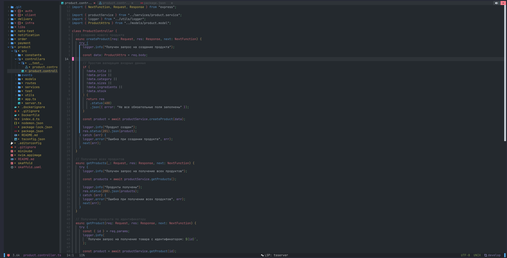
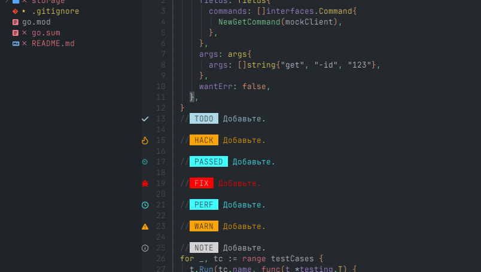

# Конфигурация Nvchad версии 2.5

  

 

  

 

## Я использую

- [ubuntu 24.04LTS](https://ubuntu.com/download/desktop)
- [wrap](https://www.warp.dev/)

## Основные команды

- `ctr + n` - открыть/закрыть Nvchad меню
- `tab` - переключиться между вкладками
- `shift + tab` - переключиться между вкладками в обратном направлении
- `ctr + \` - открыть/закрыть горизонтальный терминал
- `ctr + ]` - открыть/закрыть вертикальный терминал
- `v стрелка влево/вправо/вверх/вниз` - выделение/отмена выделения текста
- `пробел + x` - закрытие вкладки
- `пробел + e` - переход в Nvchad меню
- `ctr + b` - быстрое перемещение курсора вверхнюю часть экрана
- `a [имя файла]` - создание нового файла в рабочей директории
- `a [имя папки]/` - создание новой папки в рабочей директории
- `e` - редактирование имя файла или папки
- `d` - удаление файла или папки
- `dd` - удаление текущей строки либо копирование
- `p` - вставка строки в текущую позицию
- `← ↑ → ↓` - выбор пункта при всплывающей подсказке
- `:GoCmt` - вставка комментария в текущей строке
- `:GoRmTag` - удаление тега в текущей строке
- `:GoAddTag` - добавление тега в текущей строке
